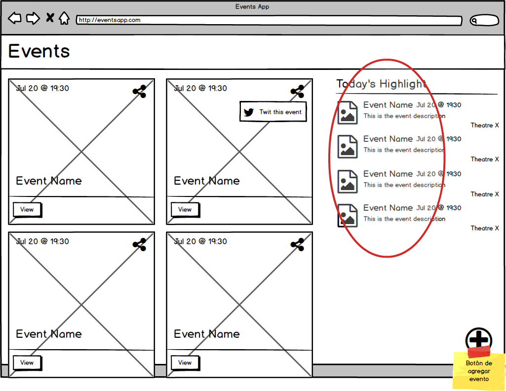
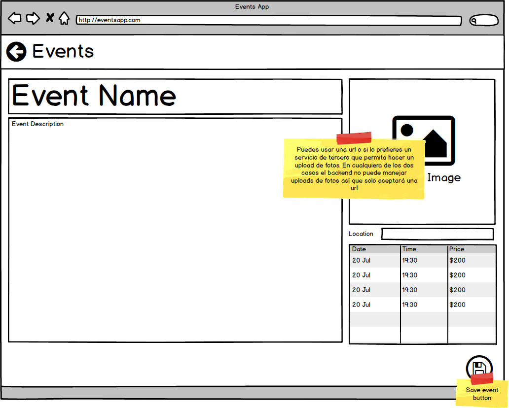

# Ingenious test for candidates - User stories

Hello **candidate**, these are the test user stories. Remember installing and testing [the backend application](..backend) before jumping into the stories. If something fails, please send us an email to [gchertok@ingsw.com](mailto:gchertok@ingsw.com).

## Index
* [The app](#the-app)
* [User stories](#user-stories)
* [Non functional requirements](#non-functional-requirements)
* [Evaluation](#evaluation)
* [FAQ](#faq)
* [Next step](#next-step)

## The app
We will develop a Single Page Application that lists and creates events. The application should be a simple event board with limited functionality.

To develop the board, we provide a simple [backend](../backend) with all the needed services already implemented.

## User stories

### Event list
As a user on the homepage, I should be able to see a list of events sorted by date.

### Share event
As a user on the homepage or the event detail page, I should be able to click on the share icon and share the event on Twitter.

The message should read "I'm going to EVENT_NAME @ EVENT_DATE."

### Event detail

As a user on the homepage, I should click on an event and be redirected to the event detail to see all the other event attributes.

### Highlighted events

As a user on the homepage, I should see on the right side a list of featured or highlighted events.

### Create event

As a user on the homepage, I should be able to create an event. The event fields should be:

* Title
* Description
* Event dates
* Place
* Picture

## Non functional requirements

The app should be written in any of the following technologies:

* Vanilla JS
* Ember
* Angular
* React
* Vue
* Any other JS framework

There's no need to use the latest version of the tools, but we expect stable and supported versions to be used.

## Evaluation

We will evaluate the proficiency of the selected technology or framework, but most importantly we will evaluate how you structure your code and how you organize the overall solution.

When selecting the framework/ libraries try choosing something you are comfortable with. It's worth nothing to create a "working" React app without using the framework characteristics like passing callbacks on props, for example. The same goes for any other framework/ library you may choose.

## FAQ

### Can I make changes to the backend application to add extra features?

Yes, remember sending the modified version.

### There's something on the user stories I don't understand

If you have a doubt and can't reach us to clarify it make the assumption that feels more natural, document it and move on. We will evaluate based on that assumption.

For example, if you don't know which event attribute you should list on the homepage choose some attributes and move on.

### I have an error running the backend

The backend application is tested, and it should work, but in some weird scenarios (never happened before) it may fail. Please [write us an email](mailto:gchertok@ingsw.com) to let us know, and so we can help you move along with the test.

### I have some extra time to add more features

Adding extra features is great, and we will look at them as well, but the best thing you can do, if having extra time is to complete as much as you can the features that are requested already. For example, try adding tests or more documentation, we will value that more than having a user management module on the app.

### I know more than one technology, which one I choose

The one you feel more comfortable with.

Don't try to use the test to learn a new technology because it's more likely you will be making learning mistakes.

## Next step

You can now start developing the application on the `frontend` folder. Good luck!
